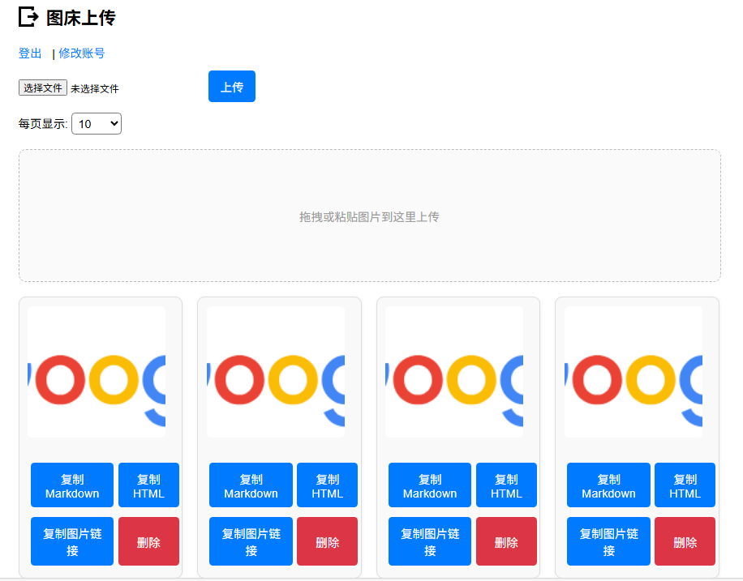

# 📷 MiniPic 图床系统

一个基于 Node.js + Express + EJS 开发的轻量图床系统，支持本地存储、登录验证、图片上传、展示、分页、删除等功能，适合个人部署或内网使用。

---

## 🚀 功能特色

- ✅ 登录验证（密码加密存储）
- ✅ 拖拽 / 粘贴 / 选择上传图片
- ✅ 图片列表分页展示
- ✅ 支持 Markdown / HTML / 原图链接一键复制
- ✅ 删除图片支持确认提示和横幅反馈
- ✅ 缩略图点击可打开大图
- ✅ 移动端适配（响应式布局）
- ✅ 修改账号密码界面
- ✅ 图片本地存储，无依赖云服务
- ✅ 支持 Docker 一键部署



---

## 📦 安装依赖

```bash
npm install
```

---

## ▶️ 启动服务

```bash
node server.js
```

访问地址：

```
http://localhost:3000
```

---

## 🛠 配置账号密码

在根目录下创建 `users.json` 文件：

```json
{
  "admin": "$2b$10$...哈希密码"
}
```

> 使用 bcrypt 生成哈希密码：

```js
const bcrypt = require('bcrypt');
bcrypt.hash("你的密码", 10).then(console.log);
```

---

## 🐳 使用 Docker 部署

你也可以从 Docker Hub 获取镜像：

📦 镜像地址：**[whooc/minipic on Docker Hub](https://hub.docker.com/r/whooc/minipic)**

```bash
docker pull whooc/minipic
docker run -d -p 3000:3000 whooc/minipic
```

如需挂载本地上传目录：

```bash
docker run -d -p 3000:3000 \
  -v $(pwd)/public/uploads:/app/public/uploads \
  --name minipic whooc/minipic
```

---

## 📁 项目结构

```
minipic/
├── public/
│   └── uploads/
├── views/
│   ├── upload.ejs
│   ├── login.ejs
│   └── account.ejs
├── users.json
├── server.js
├── package.json
├── Dockerfile
├── jt.png  ← 示例图
```

---

## 📄 License

MIT License — 可自由修改、部署、商业使用。